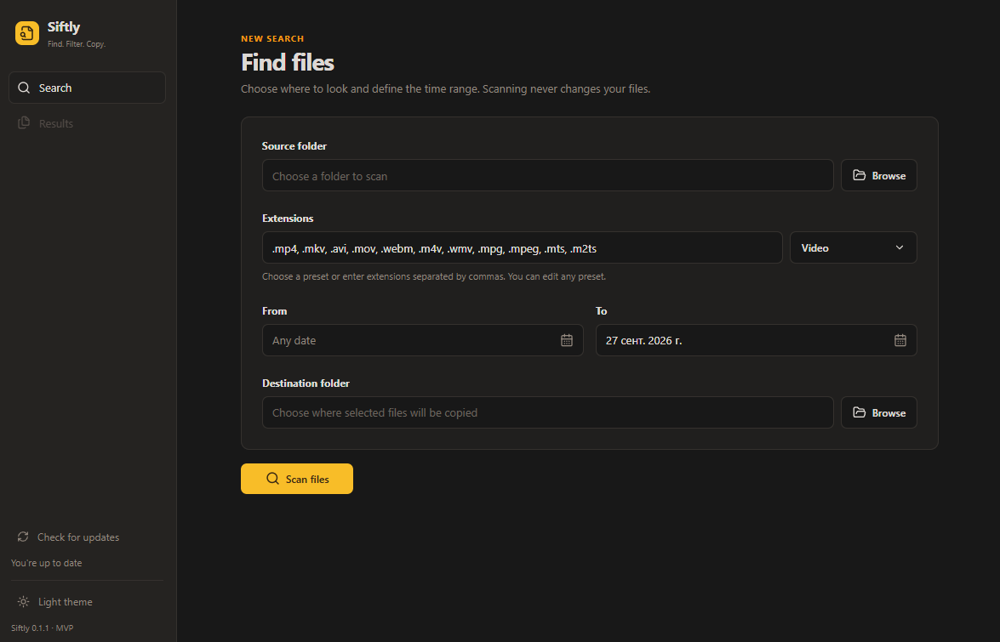
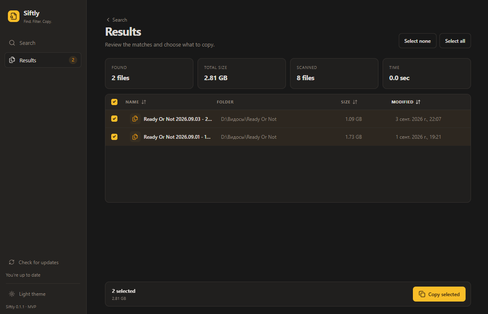

# Siftly 🔎

> **Find. Filter. Copy.**
>
> Найдите нужные файлы. Отфильтруйте результаты. Скопируйте выбранное.

Siftly — локальное Windows-приложение для поиска файлов по расширению и дате изменения. Оно сканирует выбранную папку, показывает найденные файлы и позволяет безопасно скопировать только нужные элементы в другое место.

[](#-состояние-проекта)
[](#требования-для-разработки)
[](https://tauri.app/)
[](https://react.dev/)
[](https://www.rust-lang.org/)
[](#-приватность-и-безопасность)

---

## 📸 Скриншоты

### Поиск файлов

Выбор папок, готового набора расширений и диапазона дат.



### Результаты и выбор файлов

Просмотр найденных файлов, их размеров и дат изменения перед копированием.



---

## ✨ Возможности

### 🔍 Управляемый поиск

- выбор исходной папки через системное окно Windows;
- рекурсивный поиск во вложенных папках;
- фильтрация по одному или нескольким расширениям;
- готовые наборы расширений: видео, изображения, RAW-фото, аудио, текст, документы/PDF, таблицы, презентации и архивы; выбранный набор можно изменить вручную;
- автоматическая нормализация расширений: `mp4` превращается в `.mp4`;
- поиск по диапазону дат изменения;
- фоновое сканирование без блокировки интерфейса;
- отображение количества проверенных и найденных файлов;
- возможность отменить сканирование.

### 👀 Предпросмотр перед копированием

- найденные файлы сначала отображаются в таблице;
- для каждого файла показываются имя, папка, размер и дата изменения;
- результаты можно сортировать по имени, размеру и дате;
- отдельные файлы можно включать и исключать из копирования;
- интерфейс показывает количество и общий размер выбранных файлов.

### 📂 Безопасное копирование

- копируются только явно выбранные файлы;
- кнопка **Copy selected** сразу запускает копирование без дополнительного окна;
- исходные файлы никогда не удаляются и не перемещаются;
- существующие файлы в папке назначения никогда не перезаписываются;
- при совпадении имён добавляются суффиксы `_1`, `_2` и далее;
- сохраняются даты создания, изменения и доступа, а также основные Windows-атрибуты;
- сохраняется метка происхождения `Zone.Identifier`; если её перенос невозможен, файл не считается успешно скопированным;
- ошибка одного файла не останавливает всю очередь;
- прогресс обновляется внутри больших файлов;
- отмена останавливает копирование между блоками и удаляет незавершённую копию; ошибка удаления показывается с точным путём.

Подробности и ограничения переноса метаданных описаны в [контракте копирования](docs/copy-semantics.md).

### 🎨 Современный интерфейс

- компактный интерфейс настольной Windows-утилиты;
- светлая и тёмная темы;
- янтарный акцент и спокойная нейтральная палитра;
- системные окна выбора папок;
- общий прогресс сканирования и копирования.

---

## 🔄 Как работает Siftly

```text
Сканирование  →  Предпросмотр  →  Выбор  →  Копирование
```

1. Выберите исходную папку.
2. Выберите набор расширений через **Choose preset** или введите свои, затем задайте диапазон дат. Выбор набора заменяет содержимое поля.
3. Нажмите **Scan files**.
4. Просмотрите найденные файлы и снимите флажки с ненужных.
5. Выберите папку назначения.
6. Нажмите **Copy selected**, чтобы сразу начать копирование.

До последнего шага Siftly ничего не копирует и не изменяет.

---

## 🔒 Приватность и безопасность

- **локальная обработка файлов** — файлы, имена и пути не отправляются в интернет;
- **обновления через GitHub** — при запуске и ручной проверке выполняется сетевой запрос; GitHub получает IP-адрес и обычные метаданные запроса, но не результаты поиска;
- **без телеметрии** — приложение не собирает статистику использования;
- **только чтение источника** — оригиналы не изменяются;
- **никакого автоматического удаления или перемещения**;
- **никакой перезаписи** — конфликты имён разрешаются созданием нового имени;
- поиск и копирование выполняются только на компьютере пользователя.

Rust проверяет выбранные через нативный диалог папки и разрешает копировать только файлы из последнего сканирования. В релизе CSP запрещает внешнюю сеть для WebView; проверка и загрузка обновлений выполняются отдельно в Rust через HTTPS. Установка требует нативного подтверждения и не запускается во время файловой операции. Поиск и копирование работают без интернета.

Для защиты от чрезмерного потребления ресурсов поиск ограничен 10 000 результатами, 10 000 каталогами, 1 000 000 проверенных файлов и 1 000 ошибками. При достижении лимита показывается предупреждение о частичных результатах. Символические ссылки и Windows reparse points пропускаются; для облачных файлов может потребоваться обычная локальная копия.

Текущий статус проверки и оставшиеся ограничения: [безопасность](docs/security.md).

---

## 🚀 Быстрый запуск

### Готовое приложение

Готовые установщики доступны в [GitHub Releases](https://github.com/nolllerrr/siftly/releases). Приложение также можно собрать из исходников.

Для работы нужны Windows 10/11 и Microsoft Edge WebView2. Node.js, pnpm, Rust и Python на компьютере пользователя не требуются. Версия 0.1.2 проверена пользователем в новой чистой сессии Windows Sandbox; проверка в полноценной виртуальной машине без WebView2 ещё предстоит.

Если стандартное обнаружение WebView2 не работает, Siftly проверяет установленные версии в папках Microsoft в Program Files и Local AppData и использует доступный runtime. Поиск выполняется при каждом запуске; системный реестр не изменяется. Явно заданный `WEBVIEW2_BROWSER_EXECUTABLE_FOLDER` имеет приоритет. Это помогает при рассогласовании версии в реестре и файлов runtime, но не заменяет установку отсутствующего WebView2.

Порядок проверки и ограничения Windows Sandbox: [тестирование Windows](docs/windows-testing.md).

### Требования для разработки

- Windows 10 или Windows 11;
- [Node.js](https://nodejs.org/) 22.13+ — рекомендуется актуальная LTS-версия;
- [pnpm](https://pnpm.io/) 11.19.0;
- стабильная версия [Rust](https://www.rust-lang.org/tools/install) с набором инструментов MSVC;
- Microsoft Edge WebView2 — уже установлен в актуальных версиях Windows.

### Запуск в режиме разработки

Сначала проверьте, что Node.js и npm доступны в PowerShell:

```powershell
node --version
npm --version
```

Если команды не найдены, установите [актуальную LTS-версию Node.js](https://nodejs.org/en/download) и заново откройте PowerShell. Затем установите закреплённую для проекта версию pnpm:

```powershell
npm install --global pnpm@11.19.0
pnpm --version
```

После этого запустите проект:

```powershell
cd "C:\путь\к\siftly"
pnpm install
pnpm tauri dev
```

Поиск и копирование реализованы на Rust. В проекте нет Python-скриптов, виртуального окружения и тестов, требующих Python.

### Только интерфейс

```powershell
pnpm dev
```

Этот режим подходит для визуальной разработки. Системный выбор папок, сканирование и копирование доступны только внутри окна Tauri.

> Адрес `http://localhost:1420` — только browser-preview. Кнопки выбора папок не могут открыть системное окно из обычной вкладки браузера. Для полноценной работы остановите `pnpm dev` сочетанием `Ctrl+C`, выполните `pnpm tauri dev` и используйте отдельное окно **Siftly**.

---

## 🧪 Тестирование

Workflow **Windows CI** настроен на push в ветки, pull request и ручной запуск. Он проверяет согласованность версий, frontend- и Rust-тесты, TypeScript, clippy и сборку desktop-приложения со встроенным интерфейсом. CI не создаёт установщик и не получает ключ подписи. Выпуск релиза по тегу выполняет отдельный workflow **Windows release**.

### Нативная логика Rust

```powershell
cargo test --manifest-path src-tauri\Cargo.toml
```

Тесты проверяют поиск, копирование, коллизии имён, отмену внутри файла, метаданные и ошибки доступа.

### Статический анализ Rust

```powershell
cargo clippy --manifest-path src-tauri\Cargo.toml --all-targets -- -D warnings
```

Тесты используют временные файлы и не обращаются к пользовательским данным. Ожидаемые результаты поиска и копирования закреплены в самостоятельных Rust-тестах.

### Интерфейс

```powershell
pnpm test
pnpm build
```

`pnpm test` проверяет выбор файлов, календарь и обработку прогресса. `pnpm build` проверяет TypeScript и собирает интерфейс.

---

## 📦 Сборка для Windows

Для сборки официальных подписанных обновлений нужен приватный ключ владельца проекта, хранящийся вне репозитория:

```powershell
$env:TAURI_SIGNING_PRIVATE_KEY = "$env:USERPROFILE\.siftly-signing\updater.key"
pnpm tauri build --ci
Remove-Item Env:TAURI_SIGNING_PRIVATE_KEY
```

Для собственной локальной сборки без подписи обновления: `pnpm tauri build --config '{"bundle":{"createUpdaterArtifacts":false}}'`. Такая сборка не предназначена для публикации как официальное обновление; публичный ключ в ней остаётся ключом Siftly. Для форка настройте собственные endpoint и ключ.

Готовый NSIS-установщик будет создан в каталоге:

```text
src-tauri/target/release/bundle/nsis/
```

Приложение выполняет поиск и копирование на Rust. Python-код и Python runtime в установщик не включаются; Node.js и pnpm нужны только для разработки и сборки. Перед стабильным релизом установщик нужно проверить на чистой Windows.

### Обновления приложения

Siftly проверяет обновления при запуске; кнопка **Check for updates** запускает повторную проверку. **Install update** запрашивает подтверждение, загружает установщик, проверяет подпись и подписанную версию, затем перезапускает приложение. Результаты текущего поиска не сохраняются. При ошибке сети поиск и копирование остаются доступны. В режиме разработки установка отключена.

Старая сборка без этой функции должна быть один раз обновлена вручную. До первого опубликованного релиза с `latest.json` проверка сообщает о недоступности обновлений, а не о том, что версия актуальна.

Порядок выпуска через теги, работа с ключом и проверка обновления описаны в [инструкции по релизам](docs/releases.md).

---

## 📐 Архитектура

```text
React + TypeScript
  ├─ форма поиска и таблица результатов
  └─ Tauri commands + отдельный Channel прогресса на операцию
        └─ Rust
            ├─ scanner.rs — поиск по дате и расширению
            ├─ copy_manager.rs — блочное копирование и метаданные
            └─ managed state — отмена через AtomicBool
```

Сканирование и копирование выполняются в фоновых задачах, сохраняя отзывчивость интерфейса.

### Структура проекта

```text
src/
  App.tsx             основной MVP-сценарий
  styles.css          темы и оформление интерфейса
  types.ts            TypeScript-типы протокола
  components/         компоненты интерфейса
  lib/                логика интерфейса и её тесты

src-tauri/
  src/lib.rs          нативные команды, каналы прогресса и отмена
  src/scanner.rs      рекурсивный поиск
  src/copy_manager.rs безопасное блочное копирование
  src/copy_manager/   модульные тесты копирования
  capabilities/       разрешения desktop-приложения
  tauri.conf.json     конфигурация сборки

docs/
  copy-semantics.md   правила копирования и ограничения метаданных
```

---

## 📋 Состояние проекта

### ✅ MVP реализован

- [x] выбор исходной и целевой папок;
- [x] выбор расширений;
- [x] диапазон дат изменения;
- [x] рекурсивное сканирование;
- [x] таблица результатов и размеры файлов;
- [x] сортировка по имени, размеру и дате;
- [x] выбор отдельных файлов;
- [x] нативное блочное копирование на Rust;
- [x] переименование при совпадении имён;
- [x] прогресс операций, включая копирование внутри большого файла;
- [x] сборка установщика без внешнего backend runtime;
- [x] отмена сканирования и копирования;
- [x] отображение ошибок;
- [x] светлая и тёмная темы.

### 🧭 Следующие этапы

- [ ] поиск по дате создания файла;
- [ ] фильтры по имени и размеру;
- [ ] история операций и SQLite;
- [ ] проверка свободного места перед копированием;
- [ ] профили HDD и SSD;
- [ ] получение даты из EXIF и media metadata;
- [ ] поиск дубликатов по хешу;
- [ ] несколько исходных папок;
- [ ] сохранённые поисковые наборы;
- [ ] проверка установщика на чистой Windows.

---

## 🙏 Благодарности

Визуальное направление интерфейса и подача README вдохновлены проектом [Mouzi](https://github.com/hsr88/mouzi). Siftly не копирует его функциональность и решает другую задачу: управляемый поиск, предпросмотр и безопасное копирование файлов.

Проект построен с использованием [Tauri](https://tauri.app/), [React](https://react.dev/), [Tailwind CSS](https://tailwindcss.com/), [Lucide](https://lucide.dev/) и [Rust](https://www.rust-lang.org/).

---

## Лицензия

Siftly распространяется под лицензией [MIT](LICENSE).

Copyright (c) 2026 Denis Semenov.

Сторонние зависимости распространяются под собственными лицензиями.

---

<div align="center">
  <strong>Siftly — Find what matters.</strong>
</div>
